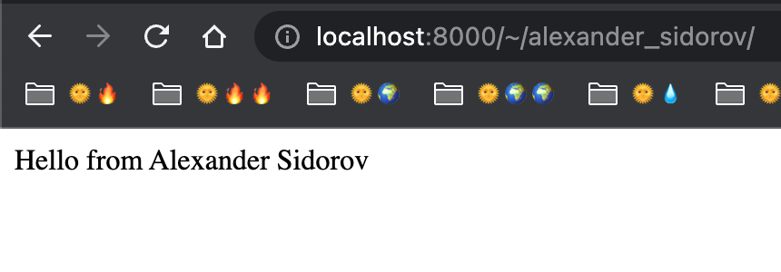

# Домашнее задание 13

За каждое задание начисляются баллы.

## Общее ТЗ

1. Пулл-реквест с ДЗ вмержен в ветку `main` до 11.1.2023.
2. Ветка называется в формате `<imia>-<familia>-lesson-13`: строчные латинские буквы, разделитель — дефис `-`.
3. Пулл-реквест называется в формате `<Imia> <Familia> Lesson 13`: латинские буквы, первая заглавная, слова разделяются пробелами.
4. В папке `hw/<ваше имя и фамилия>/` есть питон-пакет `lesson13` (далее — _рабочий пакет_).
5. В рабочем пакете есть питон-модуль `views.py` (далее - _модуль решений_).
6. На ревью предоставляется рабочий код с "зелёным" статусом пулл-реквеста.
   Оценка уменьшается на 1 за:
   1. "красный" статус, если произошел из-за вашего кода;
   2. несоответствие ТЗ;
   3. некорректное использование прошедшего материала (напр. вызов вручную магических методов);
7. Готовым для ревью считается пулл-реквест с лейблом [pr:ready-for-review](https://github.com/alexander-sidorov/m-pt1-58-22/labels).
8. Непонятные места в ТЗ, коде можно решать без предоставления ПР на ревью.

## ТЗ по задачам

---

#### 1. Hello world в Django (+10)

В рабочем модуле определена вьюха (обработчик запроса Django).
Она возвращает строку `S1` в формате HTTP сообщения, в форме ответа.

Вьюха должна быть включена в таблицу маршрутов Django: если запустить сервер
и сделать запрос на `http://localhost:8000/~/<user>/`, то сервер в ответ
вернёт строку `S1`.

Что за _"строка `S1`"_ ?

Это ваше имя и фамилия. Формат — любой, хоть русскими буквами, хоть картинкой,
лишь бы читалось моими глазами в моём браузере. UTF-8 вам в помощь.
В моём случае, я использую _`"Hello from Alexander Sidorov"`_.

Что за _`<user>`_ ? 

Это ваше имя и фамилия, записанное так же, как и ваша папка в `hw/`.
Например, в моём случае: `alexander_sidorov`.

